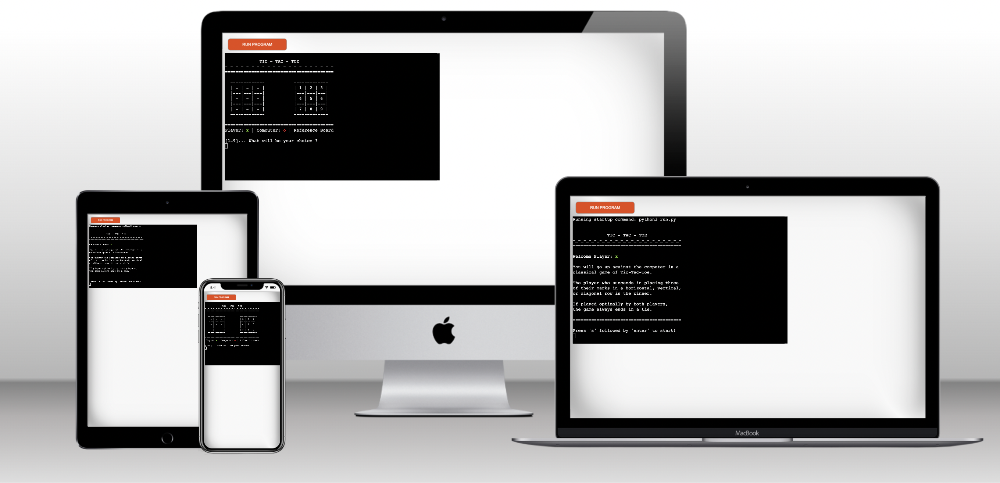

# Think-Tac-Toe: The developmental values of the game with a brain

The rationale for this project was to create a fun Tic-Tac-Toe game for children, which runs in the Code Institute mock terminal on Heroku. By encouraging logical thinking, Tic-Tac-Toe helps children develop their spatial skills. This skill is important for their problem solving abilities — from everyday simple chores to complex mathematical equations

Users will go up against the computer in a classical game of Tic-Tac-Toe. The player who succeeds in placing three of their marks in a horizontal, vertical, or diagonal row is the winner.
If played optimally by both players, the game always ends in a tie, making Tic-Tac-Toe a futile game that's been played and enjoyed for centuries.

View live project here - [Tic Tac Toe](***INSERT HERE***)

---

## Table Of Contents

* [Tic-Tac-Toe Benefits](#tic-tac-toe-benefits)
* [How To Play](#how-to-play) 
* [User Stories](#user-stories) 
* [Flow Chart](#flow-chart) 
* [Features](#features)
* [Future Features](#future-features)
* [Technology](#technology)
* [Testing](#testing)
* [Deployment](#deployment)
* [Credits](#credits)

---

## Tic-Tac-Toe Benefits

Who knew that playing a simple game of Tic-Tac-Toe could present both adults and kids with a plethora of benefits and advantages? If you didn’t (or don’t), now is the time to change your thinking about the game. As it turns out, Tic-Tac-Toe is not just a fun game, but a fun game that can teach many things to people of all ages.

**Teaches strategy skills.**
Playing Tic-Tac-Toe may seem like a game of chance at first, but after playing a few rounds, players usually notice that there’s a certain strategy and pattern of movements that can end up in a win. Because of this, it teaches players (both young and old) to start thinking strategically, which can be highly beneficial in other areas of life too. 

**Develops logical thinking.** 
There’s a great deal of logic that can be applied to a game of Tic-Tac-Toe. Simple moves that are quite logical are the ones that result in a win. This can help people to start thinking about things differently; from a more logical point of view. 

**Improves the ability to concentrate and focus.** 
To win at a game of Tic-Tac-Toe, players need to focus or concentrate for a few moments at a time. This practice at focus and concentration can help to develop these skills. This is a great skill to have in all areas of life. 

**Teaches good sportsmanship.**
Both kids and adults can benefit from learning how to be graceful when winning and losing. This is called good sportsmanship. Players of Tic-Tac-Toe must be able to handle themselves whether they win or lose. It’s a great lesson to learn from the game. 

**Sets the foundation for learning more complex games.**
When kids are developing, they need to be introduced to games in stages, based on complexity. Because Tic-Tac-Toe is a simple game, it is a great foundation game to learn before moving on to more complex and challenging games. Tic-Tac-Toe can teach all of the basics of playing a game, such as following the rules, thinking about the gameplay, watching what opponents are doing, and so on. 

**Develops problem-solving skills.**
Winning at Tic-Tac-Toe requires problem-solving. A player must solve the problem of where to put their mark to avoid losing. If you are trying to incorporate some mental stimulation in an older adult’s life or introduce basic problem-solving skills to young children, playing Tic-Tac-Toe is a great option. 

**Teaches the importance of rules.**
Rules are important in life as well as in games. In fact, you can teach children that it is unacceptable to break the rules by playing games with them. If a child breaks a rule in the middle of a Tic-Tac-Toe game, they will be disqualified and lose the game. The more a child is rewarded by following the rules, the deeper the message will sink in. 

**Helps to deal with cognitive decline.**
While playing a game cannot stop cognitive decline, it can help deal with the symptoms. It is vital for older adults to keep their minds busy. A regular brain workout is important to ensure that their mental capacity does not deteriorate. Playing Tic-Tac-Toe (and more challenging versions) is a great way to keep the brain busy and working. The more you work out your brain, the better it is for your mental health!

**Helps to reduce stress.**
Stress is a killer. It plagues the lives of both adults and children. While stress often cannot be avoided, you can do a few things to mitigate the negative impact of stress. For starters, socializing and playing games are great stress relievers. 
While you are having fun, relaxing, laughing, and not focusing on other worries, your stress levels are depleting. Because it’s so easy to play, a Tic-Tac-Toe competition can be a great way to cope with stress. 

**Builds self-confidence in young children and old adults.**
If you have a young child or much older adult struggling with confidence, playing games can really help. Having fun and actually winning a few rounds can really boost self-confidence. Tic-Tac-Toe is an easy to learn and-play game that can help boost self-confidence quickly. 

**A good form of mental stimulation for young kids and old adults.**
Mental stimulation is essential for everyone’s health. The more you stimulate your mind with exercises, puzzles, games, and social encounters, the healthier your mind will be. Now more than ever, mental health is in the spotlight. Do the right thing for your brain and give it a workout with Tic-Tac-Toe. 

---

## How To Play

1. The game is played on a grid that's 3 squares by 3 squares.

2. You are X, your friend (or the computer in this case) is O. 
Players take turns putting their marks in empty squares.

3. The first player to get 3 of her marks in a row (up, down, across, or diagonally) is the winner.

4. When all 9 squares are full, the game is over. If no player has 3 marks in a row, the game ends in a tie.

---

## User Stories

__Visitor Goals__

- As a visiting user, I want to quickly understand the purpose of the site and its intended use.
- As a visiting user, I want to easily understand how to play and start the game.
- As a visiting user, I want to excercise my Tic-Tac-Toe skills playing against a computer.
- As a visiting user, I want to be able to play as many times as I would like.
- As a visiting user, I want to get direct feedback on my actions throughout the game.

---

## Flow Chart

---

## Features

---

## Future Features

---

## Technology

__Technology__

---

__Libraries__

---

## Testing

__Manual Testing__

---

__Validator Testing__

---

__Unfixed Bugs__

---

## Deployment

__How to deploy__

---

## Credits 

__Text content__

---

__Code__

---

[Top of page](#think-tac-toe-the-developmental-values-of-the-game-with-a-brain)
